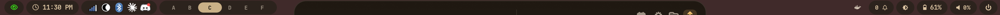
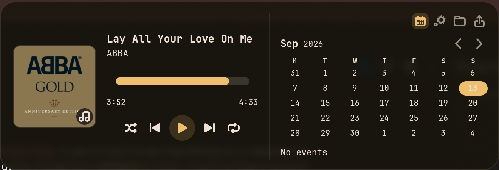
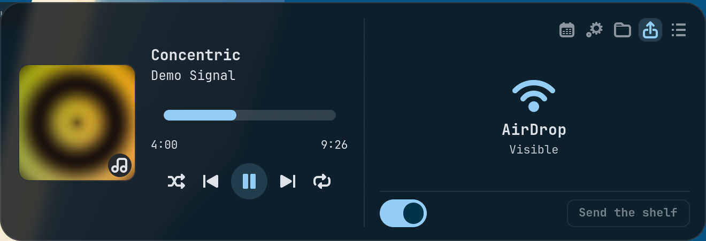
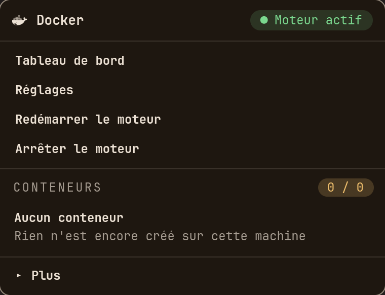
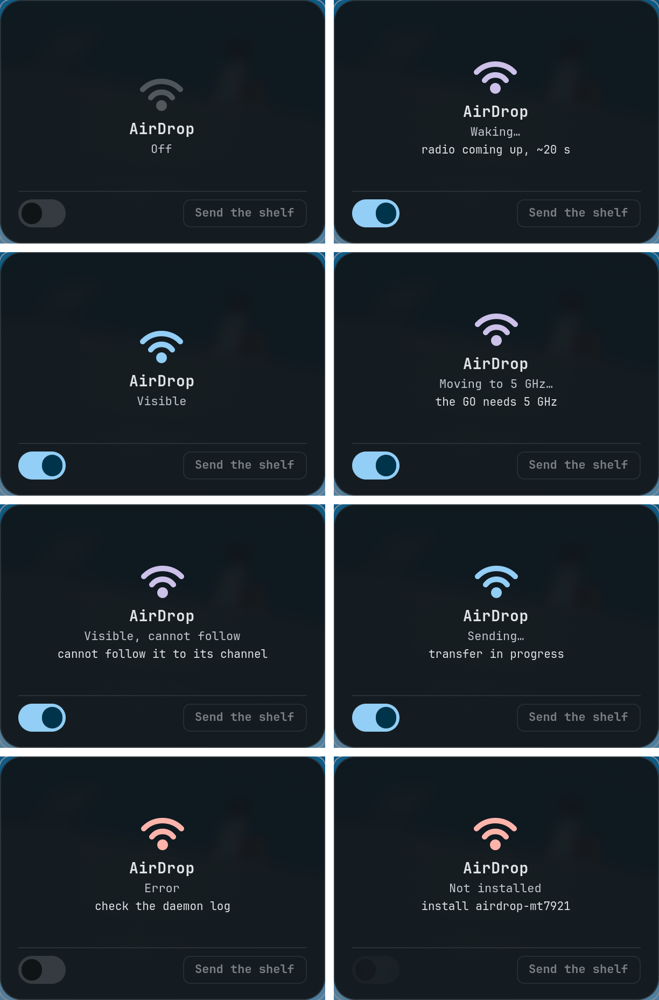

# rice-repo

A Hyprland setup on Arch Linux, built on top of the
[JaKooLit](https://github.com/JaKooLit/Hyprland-Dots) dotfiles and extended with
five custom GTK4 applications.

One rule governs the whole repository: **no colour is ever hardcoded.** The
wallpaper decides the palette, and everything else follows automatically — bar,
panels, launcher, terminal, notifications, login screen.

---

## What it looks like



The notch lives inside the bar and expands downward on hover:



Its AirDrop page, which drives [airdrop-mt7921](https://github.com/jedbillyb/airdrop-mt7921):



The Docker menu:



Nothing above uses a fixed colour. Every state below is the same palette,
derived from the current wallpaper — `primary` for visible, `tertiary` for a
transition, `error` for a fault:



---

## The five applications

Written in Python + GTK4 / libadwaita, bilingual French / English with a language
switcher, and themed from the system palette.

| | Shortcut | What it does |
|---|---|---|
| **HyprSettings** | `Super + Shift + K` | Settings panel: spacing, decoration, blur, bar, mouse and keyboard |
| **HyprKeys** | `Super + Shift + /` | Graphical keybinding editor — captures the key combination as you press it |
| **HyprWhale** | click the whale | Docker menu: containers, start/stop, terminal, logs |
| **HyprNotch** | `Super + Shift + N`, or hover | Dynamic notch: media, calendar, system, file shelf, pinned note |
| **HyprNotes** | `Super + N` | Notes as plain text files, with a sidebar that opens at the screen edge |
| **CheatSheet** | `Super + /` | Filterable shortcut list in rofi |

### HyprSettings

Every slider applies **live** — through `hyprctl keyword` under the `.conf`
parser, through `hyprctl eval hl.config({...})` under the Lua one, which refuses
`keyword` outright. Nothing touches disk until you press *Save*. It writes to four different files depending on the
setting — `looknfeel.conf`, `input.conf`, the waybar config and its stylesheet —
changing only the value concerned.

### HyprKeys

Reads and rewrites `keybinds.conf` while preserving comments, ordering and
formatting. The combination button captures the keys you actually press and
translates them into Hyprland syntax (`$mainMod SHIFT, S`).

### HyprNotch

A notch living **inside the bar**, in the spirit of BoringNotch. It takes the
place waybar's `mpris` module used to occupy: compact it shows the current
track, on hover it expands downward into a panel — cover art, progress,
controls, then a right column that switches between calendar, system stats, a
file shelf, AirDrop and the note you pinned.

The compact pill deliberately mirrors the `mpris` module it replaced — the same
Nerd Font player glyph, the same italic `artist title` — and it sizes itself to
its text instead of holding a fixed width, so it reads as one of the bar's own
islands.

The pill shows the **album art** when the player publishes one, and falls back
to the player's Nerd Font glyph when it doesn't.

It also **takes its geometry from the bar**. Font, weight, size, corner radius
and horizontal padding are read out of `islands.css`; the height and vertical
position are measured on waybar's own layer surface through the Hyprland
socket. Move a slider in HyprSettings and the notch follows within a second —
there is no second set of values to keep in sync.

With nothing playing it draws nothing at all, but the surface stays there, so
hovering the middle of the bar still opens it.

The file shelf is a drop target. Files dropped on it are never copied or moved:
it keeps paths, and each row is itself a drag source, so you pick them back up
wherever you need them.

Image rows carry a **thumbnail**. The desktop's own cached one is reused when
`thumbnail::is-valid` confirms it still matches the file, which covers videos
and PDFs for free; otherwise an `image/*` file is decoded in a worker thread
and handed back through `GLib.idle_add`. Doing it inline is not an option —
85 ms for a 1.6 MB PNG, times every row, and the panel stutters on each drop.
The thumbnail becomes the drag icon too, since that already reuses the row's
paintable.

It is a **layer surface**, not a floating window, which is what makes it centre
itself and expand from the middle for free. Media comes from **MPRIS through
Playerctl signals**, so it follows whichever player is active — Spotify,
Firefox, VLC — and nothing is hardcoded. Only the playback position is polled,
and only while the panel is open.

### HyprNotes

Also published on its own, so it runs without the rest of this rice:
**[Peralban/HyprNotes](https://github.com/Peralban/HyprNotes)**. The copy here
is the one this configuration symlinks; the notch tab lives in that repository
under `integrations/hyprnotch/`, and points back here for the other half.

One `.md` file per note in `~/.local/share/hyprnotes/`. No database, no custom
format: the notes stay greppable, editable in nvim, and **they outlive the
app**. The sidebar floats over the text rather than pushing it, and opens three
ways — mouse at the left edge, `Ctrl + B`, or the header button.

The text stays plain, but three conventions get dressed up in place: `# Heading`
(down to `###`), `**bold**`, and `- [ ]` / `- [x]` checkboxes, which you tick by
clicking the marker. The markers stay visible, only dimmed — hiding them inside
an editable area makes the cursor jump across characters you cannot see.

**The folder is also the bus between the app and the notch.** Both watch it with
`Gio.FileMonitor`, so ticking a box in the notch moves a file and the window
follows, and the other way round. No daemon, no socket — exactly how the theme
already propagates in this repo. Each note carries two independent pins: one
keeps it at the top of the list, the other shows it in the notch, and only one
note at a time can hold the second.

Editing inside the notch needs it pinned, since a notch opened on hover has
`KeyboardMode.NONE` and receives no keys. Clicking into the text claims both the
pin and the keyboard; `Escape` releases them. Ticking a box works either way — a
click always gets through.

### HyprWhale

Refreshes every 3 seconds in a background thread. State colours (green / amber /
red) are **deliberately excluded** from the theme: a crashed container has to
stay red even under a green accent.

The `⋯` context menu adapts to state — *Remove* is greyed out on a running
container, *Open localhost:port* on a stopped one.

---

## The reactive theme

`Super + W` opens the wallpaper picker. Once an image is chosen,
[matugen](https://github.com/InioX/matugen) extracts a Material You palette from
it, regenerates **twelve files**, then notifies every application concerned:

| Target | Generated file | Signal sent |
|---|---|---|
| waybar | `waybar/colors.css` | `pkill -SIGUSR2 waybar` |
| hyprland | `hypr/colors.conf` | `hyprctl reload` |
| kitty | `kitty/colors.conf` | `kill -SIGUSR1 $(pidof kitty)` |
| GTK 4 | `gtk-4.0/colors.css` | `pkill -SIGUSR1 -f "Hypr(Whale\|Notes)[.]py"` |
| GTK 3 | `gtk-3.0/colors.css` | `gtk3-reload.sh` — restart, see Notes |
| vicinae | `themes/matugen.toml` | `vicinae theme set matugen` |
| zathura | `zathura/colors.rc` | none — each launch is a fresh process |
| hyprnotch | reads `waybar/colors.css` | file monitor, live |
| rofi, cava, spicetify, vesktop | — | — |

GTK 3 needs one more thing than GTK 4: a theme that actually consumes the
colour names. `adw-gtk-theme` is libadwaita ported to GTK 3, and it references
`@window_bg_color` 219 times, so overriding that name in the user stylesheet
recolours the whole thing. Select it once — this desktop has no XSettings
daemon and GTK 3 reads GSettings here, not `settings.ini`:

```bash
gsettings set org.gnome.desktop.interface gtk-theme adw-gtk3-dark
```

GTK applications inherit the palette because `gtk-3.0/gtk.css` and
`gtk-4.0/gtk.css` import the `colors.css` matugen writes. **Without those two
one-line files, matugen generates the colours but GTK never reads them** — the
quietest trap in this whole configuration.

---

## Shortcuts

### Windows

| | |
|---|---|
| `Super + Q` | Close |
| `Super + Shift + Q` | Kill the process |
| `Super + Space` | Floating ↔ tiled |
| `Super + Shift + F` | Fullscreen |
| `Super + J` | Toggle split direction |
| `Super + S` | Show / hide the scratchpad |
| `Super + Alt + S` | Send the window to the scratchpad |
| `Super + ← ↑ ↓ →` | Move focus |
| `Super + Ctrl + ← ↑ ↓ →` | Move the window |
| `Super + Shift + ← ↑ ↓ →` | Resize |

The scratchpad is how you hide a window without closing it — Spotify quits on
`Super + Q` despite having a tray icon, so `Super + Alt + S` is the way to keep
music playing.

### Applications

| | |
|---|---|
| `Alt + Space` | Vicinae launcher |
| `Super + Enter` | Terminal |
| `Super + Shift + Enter` | Floating terminal |
| `Super + E` | Thunar |
| `Super + Shift + E` | Yazi |
| `Super + B` | Browser |
| `Super + C` | Colour picker |
| `Super + N` | Open / hide the notes |
| `Super + Shift + N` | Open / close the notch |
| `Super + Shift + S` | Screenshot — saved **and** copied to the clipboard |
| `Super + L` | Lock |
| `Ctrl + Alt + Delete` | Quit Hyprland |

### Appearance

| | |
|---|---|
| `Super + W` | Wallpaper + palette regeneration |
| `Super + Ctrl + B` | Waybar style |
| `Super + Alt + B` | Waybar layout |
| `Super + R` | Restart waybar and swaync |
| `Super + H` | Hide the bar |

### Workspaces

`Super + 1…0` to switch, `Super + Shift + 1…0` to send the window there,
`Super + scroll` to cycle, three fingers horizontally on the touchpad.

---

## Dependencies

```bash
sudo pacman -S --needed \
  hyprland waybar rofi kitty swaync hyprlock hypridle hyprpolkitagent \
  awww matugen-bin thunar yazi adw-gtk-theme \
  gnome-keyring seahorse \
  brightnessctl hyprpicker playerctl wl-clipboard grim slurp \
  blueman network-manager-applet pavucontrol nwg-displays mission-center \
  docker docker-compose docker-buildx lazydocker \
  python-gobject gtk4 libadwaita gtk4-layer-shell \
  ttf-jetbrains-mono-nerd noto-fonts-emoji fastfetch btop
```

```bash
yay -S vicinae-bin sddm-silent-theme
```

Docker needs two more steps:

```bash
sudo systemctl enable --now docker.socket
sudo usermod -aG docker $USER
```

Then **reboot**. Logging out is not enough: `user@1000.service` survives the end
of a session and keeps the group set it started with.

---

## Installation

```bash
git clone git@github.com:Peralban/Rice-Linux-nux-nux.git ~/.rice-repo
cd ~/.rice-repo && ./install.sh
```

That installs everything. Components can also be taken one at a time — the bar
without the launcher, the notch without the login screen:

```bash
./install.sh --list             # what is available
./install.sh waybar matugen     # just those
./install.sh --dry-run          # show the links, touch nothing
```

`install.sh` symlinks the files into `~/.config`, moving whatever it replaces to
`~/.config-backup-<date>`. It tells you when a component will look broken
without its neighbour — the bar without `matugen` has no palette to read.

Files are **never copied**: `~/.config/hypr/hyprland.conf` is a symlink to
`~/.rice-repo/config/hypr/hyprland.conf`. Editing either one is the same thing,
and `git status` sees the change immediately.

The login screen lives outside `$HOME` and needs root, so it has its own script:

```bash
~/.rice-repo/system/sddm/install-sddm.sh
```

---

## Structure

```
config/
├── hypr/
│   ├── hyprland.conf          autostart, monitor, sources
│   ├── hyprland.lua           the 0.57 port — validated, see Notes
│   ├── configs/               keybinds, windowrules, tags, looknfeel, input, animations
│   ├── scripts/               the applications + screenshot, wallpaper picker
│   ├── scripts/hyprnotch/     the notch, split into core / theme / ui / widgets
│   └── scripts/hyprnotes/     the notes: store, light markup, window
├── waybar/
│   ├── UserModules            Docker module and brightness slider
│   ├── Modules                base definitions (tray, mpris, backlight…)
│   ├── configs/               bar layouts
│   └── style/                 stylesheets
├── zathura/                   PDF reader, colours included from colors.rc
├── matugen/                   palette generation chain
├── swaync/themes/             notification centre
├── vicinae/                   launcher settings (theme, compact mode, telemetry)
├── airdrop/                   AirDrop: patches, tools, recovery path — see its README
└── gtk-3.0, gtk-4.0/          the two lines that wire GTK into matugen

docs/screens/                  the screenshots above

system/
└── sddm/                      login screen, mirrors the lock screen
```

---

## Notes

A few traps hit while building this, kept here because they are written nowhere
else.

**Hyprland 0.56 changed the window rule syntax.** `class:^(kitty)$` becomes
`match:class ^(kitty)$`, `float` becomes `float true`, `ignorealpha` becomes
`ignore_alpha`, and `ignorezero` no longer exists. The `.conf` format itself
disappears in 0.57 in favour of Lua.

**zathura styles itself, not through GTK.** It is a GTK4 client, so it picks
up `gtk-4.0/colors.css` like any other — and none of that reaches the document
view, the statusbar or the completion list, because every one of those is a
zathura setting rather than a CSS rule. It needs its own generated file,
included from `zathurarc`. Search highlights have to be translucent to sit on
top of the text; matugen only emits `rgba()` at full opacity, but GdkRGBA reads
8-digit hex, so the alpha is written in the template.

**A GTK 3 theme does not read libadwaita's colour names.** Adwaita 3.24
consumes `@theme_bg_color`, `@theme_base_color` and that family; pointing the
gtk-3.0 template at the gtk-4.0 one generates a file that is imported and then
ignored in full, which is exactly how Thunar stayed light under a dark rice.

**GTK 3 reads its stylesheet once per process and never again.** Measured on a
running Thunar: rewriting the imported palette changes nothing, touching
`gtk.css` changes nothing, and toggling `gtk-theme` through gsettings changes
nothing. Only a fresh process picks up a new colour — and since Thunar reuses
its running instance over D-Bus, one stale process would serve the old palette
to every window it opens from then on.

**`ON_DEMAND` does not mean "take the keyboard", it means "the compositor
will hand it over on the next click".** Switching to it *during* a click is
therefore too late: that click was already settled under the previous mode,
and a second one was needed for nothing. Arm it on hover instead — measured
safe, since switching an already-mapped surface to `ON_DEMAND` takes no
focus on its own. A surface *mapped* with it does, which is the case that
misleads you.

**A layer surface in `KeyboardMode.ON_DEMAND` keeps the keyboard only until
you click elsewhere.** The compositor then serves the next window, but the
notch stays pinned and open — alive on screen, listening to nothing, and you
have to click it again to wake it. It has to watch `notify::is-active`, save,
release the keyboard and unpin on its own.

**Under the Lua config, `hyprctl keyword` is refused outright** — *"keyword
can't work with non-legacy parsers. Use eval."* That is the one mechanism
HyprSettings uses to apply a slider live, so every control went silent the day
`hyprland.lua` landed in `~/.config/hypr/`. The panel now detects the parser and
falls back to `hyprctl eval hl.config({...})`.

**`hyprland.lua` reads `looknfeel.conf` and `input.conf` rather than freezing
its own values**, the same way it already reads `colors.conf` for the palette.
Without that, it overwrote every setting at each start and the panel appeared to
forget what you had saved.

**A `css_gap` wants its four sides named.** `gaps_out = { 2, 3, 3, 3 }` is
accepted without a word of complaint and then ignored, which silently leaves the
outer gaps at zero. Only `{ top = …, right = …, bottom = …, left = … }` — or a
single integer — actually lands.

**The `swww` package was renamed `awww`.** Configurations still calling
`swww-daemon` fail silently.

**matugen 4.x** refuses to pick between candidate source colours without an
interactive terminal: `--prefer saturation` is mandatory from a keybinding. It
also dropped `arguments = [...]` in `[config.wallpaper]` in favour of a single
command containing `{{ image }}`.

**Hyprland grows floating windows around their centre.** A popup that expands
therefore climbs off the top of the screen. HyprWhale re-anchors its top-left
corner on every frame, through the IPC socket (0.16 ms) rather than `hyprctl`
(10 ms).

**GTK grows a mapped window but never shrinks it.** `set_default_size` has no
effect once the window is shown; you have to ask the compositor to resize using
the height `measure()` reports.

**Nerd Font glyphs live in the Unicode private use area.** A stray space after a
glyph (`" "`) visibly shifts the icon inside its pill.

**SDDM 0.21 runs a Qt6 greeter.** A theme must declare `QtVersion=6` in its
`metadata.desktop` or it is ignored in silence and SDDM falls back to a plain
white box. The three stock themes (elarun, maldives, maya) are all Qt5 and never
load.

**The `sddm` user cannot read `$HOME`** when it is `drwx------`. The login
screen wallpaper has to be copied into the theme directory, not symlinked.

**zsh-autocomplete must be sourced before oh-my-zsh.** oh-my-zsh runs `compinit`
before sourcing plugins, so the plugin's `Completions/` directory reaches
`fpath` after the scan and its functions are never registered.

**Vicinae's compact mode does nothing while something is showing at root.** An
unread "What's New" item keeps the launcher expanded, and the telemetry notice
only stops counting as one when `telemetry.system_info` is set to `false`. The
file-indexer toast does the same for the first few seconds after a server
restart. The window never changes size either way — the layer surface stays
770x480 and only the drawn content collapses — so `hyprctl layers` cannot tell
you whether compact mode is on. Take a screenshot.

**Vicinae writes its config in place, following symlinks**, so `settings.json`
can live in the repository like everything else. Changing a setting in its GUI
edits the repository file directly.

**A GTK4 window grows but never shrinks itself.** Lowering a size request does
nothing once the window is mapped; only `set_default_size()` with explicit
values brings a layer surface back down. HyprNotch's whole open/close animation
rests on that one call.

**`Gdk.Surface.set_input_region()` is overwritten by GTK on Wayland.** The
obvious notch design — one big transparent surface with a clickable hole — is
therefore impossible: the region is computed correctly and then ignored, and
the transparent area keeps swallowing clicks. The surface has to be exactly the
size of what you can see, which is also what makes hover detection reliable.

**A `Gtk.Stack` is homogeneous by default**, so its minimum size is that of its
largest page. The compact view was being centred inside the expanded view's
224 px and drawn outside the 30 px window — visible as an empty pill.
`hhomogeneous=False, vhomogeneous=False` is the fix.

**gtk4-layer-shell must be loaded before libwayland-client.** From Python it
never is, so the launcher re-executes itself once with `LD_PRELOAD` set;
without it the window silently falls back to a normal toplevel.

**A fully transparent GTK window never commits a frame.** With nothing playing,
the notch's shell draws nothing — and the layer surface stayed frozen at GTK's
200x200 fallback, an invisible block in the middle of the bar. GTK's own idea of
the window was already correct (230x22); it simply never told the compositor.
One per cent of background alpha is enough to force the frame, and measured
against a bare bar the difference is 1/255.

**The bar's centre is deliberately empty.** `modules-center` holds nothing:
HyprNotch sits there as a layer surface with `exclusive_zone = -1`, which is
what lets it ignore waybar's own exclusive zone and share the same strip. The
clock's hover calendar is off for the same reason — the notch has one.

**An ellipsizing `Gtk.Label` reports a truncated natural width**, so measuring
the pill through `measure()` made it size to the cut-off text and then cut the
text to fit. `create_pango_layout()` gives the real extent. A `Gtk.Picture` has
the opposite problem: its natural size is the texture's, so the album art grew
or shrank with the length of the track title until it was clipped by a
non-propagating container.

**Nothing in the panel pins it open.** An earlier version pinned on any click,
which meant clicking a tab left the notch stuck open with no obvious way back —
only `Super + N` closes a pinned panel, and hovering away no longer worked.
Hover opens and closes; `Super + N` is the only thing that pins.

**Measure the bar, don't recompute it.** Deriving the pill's height from the
font size and padding gave 25 px where waybar's islands were 23. Asking the
compositor for waybar's layer geometry and subtracting the group padding is
exact, and it keeps working when any of those settings change.

**Nerd Font player logos are not icon-sized.** The Spotify glyph fills far more
of its em box than the bar's own icons: at the same font size it rendered 12 px
tall against their 9.5. The pill scales its glyph to 78 % so the two match, and
takes `@secondary` — the colour waybar gives every module — instead of the
accent.

**waybar's `font-size: 94%` is not 94%.** It sits on the universal selector, so
it re-applies at every level of waybar's widget tree and the text it actually
draws is far smaller than the figure suggests. Reproducing the percentage
literally gave a pill a third too large — capital letters 10.5 px against the
bar's 8.0. HyprNotch scales the percentage by a factor measured between the two
renders rather than trusting the number.

**A drop target for files needs more than `GdkFileList`.** File managers offer
one, but browsers and Electron apps hand over `text/uri-list` or a bare path as
text. HyprNotch's target accepts all three and normalises them to paths. It also
opens the panel in a single resize during a drag rather than animating twenty of
them under a pointer the compositor is already tracking.

Drag-and-drop events are traced to `~/.cache/hyprnotch/dnd.log` — the file only
grows when something is dropped, and it records what the source actually
offered.

**`Gdk.ContentProvider.new_typed()` does not exist in the Python bindings.** It
is a C varargs convenience, so calling it from a `prepare` handler raised
inside the signal and no drag ever started — dropping files *into* the shelf
worked, dragging them back out silently did nothing. Build the provider from
`GObject.Value` instead, and union a `GdkFileList`, a `GFile` and a raw
`text/uri-list` so any target finds a format it understands.

**Turning the shell transparent before the animation ends looks broken.** When
the notch collapses back to nothing, dropping the background immediately left
the panel's text floating over the desktop for the last frames of the shrink.
The ghost state is applied on the animation's `done` signal instead, and fades
out over 140 ms.

**The shell's 1 px border eats into the pill.** Asking the compact box for the
full island height left it a pixel taller than the space inside the border, so
everything in it — the album art most visibly — sat a pixel low. The box asks
for the height minus the border on both sides.
